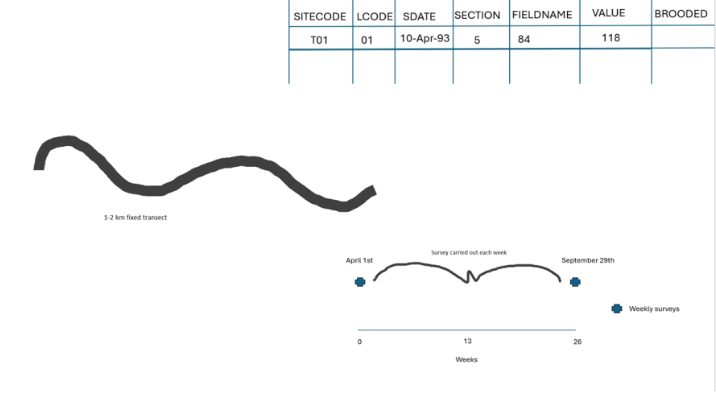
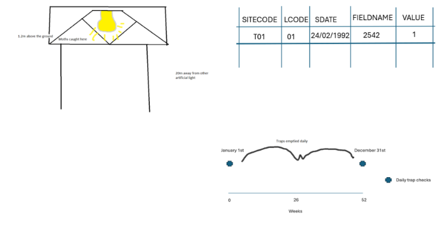

```{r setup, include=FALSE}
#Code to setup packages should go here, for example
library(dplyr)
library(tidyr)
library(knitr)
library(ggplot2)
library(lubridate)
library(viridis)
library(hrbrthemes)
library(RColorBrewer)
library(readr)
```

```{r data, message=FALSE, warning=FALSE}
#Code for the datasets
mothsData <-read_csv("Invertebrates/ECN_IM1.csv")
mothsSuppDoc <-read_csv("Invertebrates/ECN_IM2.csv")

butterfliesData <-read_csv("Invertebrates/ECN_IB1.csv")
butterfliesSuppDoc <-read_csv("Invertebrates/ECN_IB2.csv")

woodlandData <- read_csv("Vegetation/ECN_VW1.csv")
woodlandSuppDoc <- read_csv("Vegetation/ECN_VW2.csv")

fineGrainData <- read_csv("Vegetation/ECN_VF1.csv")
fineGrainSuppDoc1 <- read_csv("Vegetation/ECN_VF2.csv")
fineGrainSuppDoc2 <- read_csv("Vegetation/ECN_VF3.csv")

baselineData <- read_csv("Vegetation/ECN_VB1.csv")
baselineSuppDoc <- read_csv("Vegetation/ECN_VB2.csv")

```

# Task 1: Context and study design

Monitoring for the five datasets occurs across 12 ECN sites (T01-T12) using standardised protocols to track UK biodiversity. All surveys use specialised species codes like BMS for insects or VESPAN for plants along with quality codes to flag any recording errors.
Invertebrate sampling compares the abundance of butterflies and moths but the methods differ in effort. Butterflies are recorded via active weekly transects between April and September while moths are caught using passive nocturnal light traps that are ideally emptied daily. Butterfly surveys are strictly gated by weather conditions like temperature while moth traps operate year-round. These data support questions about how climate change influences insect population size and how populations act as indicators for the health of local plants.
Vegetation monitoring uses a nested design with 40cm cells to measure plant frequency. The Baseline survey was a one-off characterisation between 1991 and 2000 that used 2m plots to establish a site map. In contrast Fine-grain and Woodland surveys use 10m plots with 10 random cells. Fine-grain data tracks community shifts every three years while the Woodland survey measures tree height and thickness every nine years to evaluate carbon storage. These datasets help researchers identify the best locations for long-term monitoring and show how plant communities respond to drivers such as pollutants.

# Task 2: Diagrams

## Fine-grain vegetation
```{r Fine-grain data diagram, out.width='80%'}

```

## Woodland
```{r Woodland data diagram, out.width='80%'}

```  

## Baseline vegetation
```{r Baseline vegetation data diagram, out.width='80%'}

```

## Butterflies
```{r Butterfly data diagram, out.width='80%'}

```

## Moths
```{r Moth data diagram, out.width='80%'}

```


# Task 3: Data quality assessment

## Fine-grain vegetation
```{r Fine-grain-DQA, message=FALSE, warning=FALSE}
fineGrainCombined<-left_join(fineGrainData, fineGrainSuppDoc1, by=c("SITECODE", "SYEAR", "PLOTPID"))
fineGrainClean<-fineGrainCombined %>% filter(FIELDNAME == "VEG_SPEC")
richnessData <- fineGrainClean %>% group_by(SITECODE, SYEAR, PLOTPID) %>% summarise(speciesCount = n_distinct(VALUE), .groups = "drop")
richnessWithSlope <- fineGrainClean %>% group_by(SITECODE, SYEAR, PLOTPID, SLOPE) %>% summarise(speciesCount = n_distinct(VALUE), .groups = "drop")

# Table
fineGrainDQATable <- fineGrainClean %>% group_by(SITECODE) %>% summarise(n_records = n(), n_years = n_distinct(SYEAR), n_plots = n_distinct(PLOTPID), missing_species = sum(is.na(VALUE)), prop_missing = mean(is.na(VALUE)), .groups = "drop"); fineGrainDQATable

# Figure 1
fineGrainSiteCounts<-table(fineGrainClean$SITECODE)
barplot(fineGrainSiteCounts,col="lightblue",main="Figure 1: Fine-grain Records per Site",las=2,ylab="Number of Observations")

# Figure 2
fineGrainPlotCounts<-fineGrainClean %>% group_by(SITECODE) %>% summarise(nPlots = n_distinct(PLOTPID))
barplot(fineGrainPlotCounts$nPlots,names.arg=fineGrainPlotCounts$SITECODE,col="lightblue",main="Figure 2: Unique Plots Surveyed per Site",las=2,ylab="Number of Unique Plots")
```

a) General overview

The fine-grain dataset tracks species presence within 10m plots but botanical accuracy is frequently eroded by human uncertainty. As shown in the summary statistics in the table the data is very consistent once recorded because there are zero missing species values. However site T11 recorded possible ID errors in 1999 and the site T01 surveyor was not 100% sure about specific species codes which shows that identification consistency is not uniform across the network.

b) Missingness

Missingness in this dataset is not random and is often driven by environmental barriers or logistical gaps. The barplot in Figure 1 identifies a major completeness gap at site T06 which has significantly fewer records than the rest of the network. Furthermore the analysis of unique plots in Figure 2 reveals that site T06 also has the lowest number of physical sampling locations. The qtext said that site T09 lost access rights to specific plots which illustrates that missingness is frequently caused by site-level failures rather than random chance.

c) Data issues

Uncertainty in naming species at site T01 in 2009 is a meaningful issue because it can lead to the wrong value being assigned to the wrong species and this creates a bias in richness counts. Furthermore plot relocation is a landmark problem because at site T12 deer destroyed the marker posts. As shown in Figure 2 the number of unique plots varies between sites which suggests that the spatial layout is not consistent. Consequently the reliability of the long-term analysis is compromised because researchers may not be surveying the exact same spatial location in the future which erodes the validity of the time trends.

## Woodland
```{r Woodland DQA, message=FALSE, warning=FALSE}
woodlandCombined<-left_join(woodlandData, woodlandSuppDoc, by=c("SITECODE", "SYEAR", "PLOTPID"))
woodlandFiltered<-woodlandCombined %>% filter(FIELDNAME %in% c("DIAMETER", "HEIGHT", "DISTANCE", "NUM_STEMS"))
woodlandClean<-woodlandFiltered %>% pivot_wider(names_from = FIELDNAME, values_from = VALUE, values_fn = mean)
woodlandClean$DIAMETER<-as.numeric(woodlandClean$DIAMETER)
woodlandClean$HEIGHT<-as.numeric(woodlandClean$HEIGHT)
woodlandZoomed<-woodlandClean %>% filter(DIAMETER < 100)

# Table
woodlandDQATable <- woodlandClean %>% group_by(SITECODE) %>% summarise(n_records = n(), n_years = n_distinct(SYEAR), n_plots = n_distinct(PLOTPID), missing_diameter = sum(is.na(DIAMETER)), prop_missing_diameter = mean(is.na(DIAMETER)), .groups = "drop"); woodlandDQATable

# Figure 1
woodlandHeightComparison<-woodlandClean %>% filter(SITECODE %in% c("T05","T09"))
boxplot(HEIGHT ~ SITECODE,data=woodlandHeightComparison,col="lightblue",main="Figure 1: Height Validity: T05 vs T09",ylab="Height (m)")

# Figure 2
woodlandYearCounts<-table(woodlandData$SYEAR)
barplot(woodlandYearCounts,col="lightblue",main="Figure 2: Woodland Observations by Year",las=2,ylab="Number of Observations")
```

a) General overview

The woodland data monitors tree growth via diameter and height but site-level shortcuts have significantly hit the validity of these measurements. Consistency is undermined at site T09 because dummy codes of 999 were used for missing identifiers which is inconsistent with other sites. As shown in the boxplot in Figure 1 validity is also compromised at site T05 because heights were merely estimated because tree density made accurate recording impossible. The table shows that there are some missing diameter values across the sites which further erodes the completeness of the growth records.

b) Missingness

Missingness is linked to physical site conditions and human error. Site T09 has a recurring pattern where large lists of plots could not be relocated which causes significant data gaps in the spatial records. The barplot in Figure 2 reveals that missingness follows a predictable temporal pattern because observations are not recorded every year. There are large peaks in years like 1994 and 2008 while other years have very low counts. There is also a biological missingness at site T08 where no trees were logged for several years. As Figure 2 demonstrates this is not an equipment failure but a reflection of the status of the site that results in null values for growth variables in specific years.

c) Data issues

Systematic measurement errors at site T05 are a major concern because heights were estimated in 1994 and any regression models using this variable will be based on subjective guesses rather than maths. Secondly the relocation failure at site T09 in 2000 is a landmark issue for the 9-year growth cycle. If the same plot cannot be found consistently then the rate of change for that specific area of woodland cannot be accurately calculated. These issues combined with the inconsistent record frequencies shown in Figure 2 prove that the reliability of the long-term trends is lacking in some instances.

## Baseline vegetation
```{r Baseline DQA, message=FALSE, warning=FALSE}
baselineCombined<-left_join(baselineData, baselineSuppDoc, by=c("SITECODE", "SYEAR", "PLOTPID", "PLOTTYPE"))
baselineClean<-baselineCombined %>% filter(FIELDNAME == "VEG_SPEC")
baselineRichness <- baselineClean %>% group_by(SITECODE, SYEAR, PLOTPID, PLOTTYPE) %>% summarise(speciesCount = n_distinct(VALUE),.groups = "drop")

# Table
baselineDQATable <- baselineClean %>% group_by(SITECODE) %>% summarise(n_records = n(), n_years = n_distinct(SYEAR), n_plots = n_distinct(PLOTPID), missing_species = sum(is.na(VALUE)), prop_missing = mean(is.na(VALUE)), .groups = "drop")
baselineDQATable

# Figure 1
baselineYearCounts<-table(baselineData$SYEAR)
barplot(baselineYearCounts,col="lightblue",main="Figure 1: Baseline Establishment Timeline",las=2,ylab="Number of Observations")

# Figure 2
baselineTypeCounts<-table(baselineData$PLOTTYPE)
barplot(baselineTypeCounts,col="lightblue",main="Figure 2: Standard (S) vs Woodland (W) Plot Counts",ylab="Number of Observations")
```

a) General overview

Baseline data serves to characterise the sites at the project inception but its consistency is eroded by the lack of supplemental quality text files found in other datasets. Validity is also a concern in the D1 table where quality codes like Q1 are placed directly in the species name column which implies that researchers must manually filter the list to avoid counting non-biological labels as species. As shown in the table the data structure is consistent across sites however the lack of site manager notes makes it difficult to evaluate the specific reasons for gaps or unusual records.

b) Missingness

Missingness is explicitly recorded via the UNSURVEYED column in the D2 table usually stemming from physical barriers on site. Furthermore the timeline of the survey represents a major completeness issue for a baseline study. As shown in the barplot in Figure 1, there were many observations in 1994, while barely any in 1997, as the different sites are surveyed at different times. This proves that the baseline for the UK was not a single snapshot but was spread over a decade of environmental shifts which erodes the ability to compare all locations as if they started from exactly the same point in time.

c) Data issues

There are issues such as biological disturbances, because plots at site T01 are marked with code 142 which indicates grazing by cattle. This implies the species list is likely an undercount as the evidence was eaten before the researchers arrived. Additionally the distribution of plot types shown in Figure 2 shows a lack of balance between Standard and Woodland locations. The results show that the dataset is dominated by Standard plots while the Woodland records are much more limited. This inconsistency means that the spatial coverage is not uniform which might lead to bias when comparing the biodiversity of different habitat types across the network.

## Butterflies
```{r Butterfly DQA, message=FALSE, warning=FALSE}
butterfliesCombined<-left_join(butterfliesData, butterfliesSuppDoc, by=c("SITECODE", "SDATE", "LCODE"))
butterfliesClean<-butterfliesCombined %>% filter(FIELDNAME != "XX")
butterfliesZoomed<-butterfliesClean %>% filter(VALUE < 10)

# Table
butterflyDQATable <- butterfliesClean %>% group_by(SITECODE) %>% summarise(nRecords = n(), nWeeks = n_distinct(WEEK), missingCounts = sum(is.na(VALUE)), propMissing = mean(is.na(VALUE)), .groups = "drop")
butterflyDQATable

# Figure 1
plot(butterfliesClean$TEMP,log(butterfliesClean$VALUE+1),col="lightblue",pch=16,main="Figre 1: Butterfly Temperature Protocol Check",xlab="Temperature (C)",ylab="Log of Count")
abline(v=13,col="red",lwd=2)

# Figure 2
butterflySiteCounts<-table(butterfliesClean$SITECODE)
barplot(butterflySiteCounts,col="lightblue",main="Figure 2: Butterfly Records per Site",las=2,ylab="Number of Observations")
```

a) General overview

The Butterfly Monitoring Scheme (BMS) tracks abundance through fixed transects but validity is often eroded by protocol deviations. While the weather gate requires 13-17 degrees site T05 recorded walks at only 11 degrees. Additionally species identification is sometimes uncertain with sites T06, T09, and T10 recording difficulty distinguishing between different Small Skipper species. As shown in the table the average temperature varies between sites which confirms that the conditions during the walks were not uniform across the network.

b) Missingness

Missingness is environmentally filtered because the survey can only occur during warm and dry windows. This leads to many weeks being recorded as zero in the counts file. As shown in the barplot in Figure 2 there is a massive imbalance in the number of records between sites. Locations like T10 have over 13,000 observations while site T12 has fewer than 50.

c) Data issues

The primary issue is the violation of the temperature protocol which is visualised in Figure 1. Since butterfly activity drops in the cold the records below 13 degrees represent a bias caused by weather rather than a real population decline. Secondly the estimation bias at site T02 is a major validity issue because using estimated temperatures to predict real butterfly counts makes any resulting correlations unreliable. These deviations from the BMS protocol mean that the validity of the data is lacking for specific sites and years which complicates a simple linear analysis.

## Moths
```{r Moth DQA, message=FALSE, warning=FALSE}
mothsCombined <-left_join(mothsData,mothsSuppDoc,by=c("SITECODE","SDATE","LCODE"))
mothsFiltered<-mothsCombined %>% filter(!FIELDNAME %in% c("Q1", "XX"))
mothsClean<-mothsFiltered

# Table
mothDQATable <- mothsClean %>% group_by(SITECODE) %>% summarise(n_records = n(), n_years = n_distinct(YEAR), n_weeks = n_distinct(WEEK), missing_counts = sum(is.na(VALUE)), prop_missing = mean(is.na(VALUE)), .groups = "drop")
mothDQATable

# Figure 1
hist(mothsClean$SPERIOD_D,breaks=30,col="lightblue",main="Figure 1: Distribution of Moth Sampling Effort",xlab="Days Trap was Open (SPERIOD_D)")

# Figure 2
mothSiteCounts<-table(mothsClean$SITECODE)
barplot(mothSiteCounts,col="lightblue",main="Figure 2: Moth Records per Site",las=2,ylab="Number of Observations")
```

a) General overview

Moth monitoring relies on standard light traps but site-specific technical failures have hit the quality of the recent data. Consistency was compromised at site T05 in 1998 when the killing fluid was switched to ethyl acetate which potentially altered specimen preservation. Validity was also impacted at site T06 in 2006 where a blown bulb resulted in only a partial catch being recorded. As shown in the summary statistics in Table 5 the average counts vary across the sites which indicates that recorded abundance is not uniform across the network.

b) Missingness

Missingness in this dataset is not random and is often detected through specific codes in the site manager notes. At sites T04 and T10 these codes show that traps were out of action for months at a time which severely erodes the completeness of those specific years. The barplot in Figure 2 reveals that site T12 has significantly fewer observations than other locations like T09 or T01. This indicates that missingness often occurs in long-term blocks or at specific sites which makes the dataset less representative of the whole UK.

c) Data issues

Uneven sampling effort is a massive issue which is visualised in the histogram in Figure 1. The sampling period column shows that while most traps are emptied daily they were occasionally left for up to 56 days which creates a bias because a catch over several weeks is significantly less meaningful than a single night. Most concerning is the selection bias at site T04 in 1993 where only positive catches were recorded. By removing the zeros the site manager has effectively fabricated a higher population density than actually exists and this issue combined with the site gaps shown in Figure 2 means that the validity of the abundance data is lacking in some instances.


# Task 4: Exploratory data analysis

## Fine-grain vegetation
```{r Fine-grain-EDA, warning=FALSE, message=FALSE}
# Univariate structure Plot
hist(richnessData$speciesCount,breaks=15,col="lightblue",main="Fine-grain Species Richness",xlab="Number of Species")

# Temporal dynamics Plot
boxplot(speciesCount ~ SYEAR,data=richnessData, main="Richness over Time",xlab="Year",ylab="Species Count",col="lightblue",las=2)

# Spatial dynamics Plot
boxplot(speciesCount ~ SITECODE,data=richnessData,main="Richness by Site",xlab="Site Code", ylab="Species Count",col="lightblue",las=2)

# Relationships Plot
plot(richnessWithSlope$SLOPE,richnessWithSlope$speciesCount,main="Richness vs Slope",xlab="Slope (Degrees)",ylab="Species Count",pch=16,col="lightblue")

# Table
fineGrainEDATable <- richnessData %>% group_by(SITECODE) %>% summarise(mean_richness = mean(speciesCount), median_richness = median(speciesCount), sd_richness = sd(speciesCount), min_richness = min(speciesCount), max_richness = max(speciesCount), .groups = "drop"); fineGrainEDATable
```

a) Univariate structure

Question: What is the distribution of plant richness?
Justification: A histogram shows the frequency of unique species counts to detect patterns such as zero inflation
Results: Data is right-skewed, peaking between 15 and 25 species.
Interpretation: Vegetation is moderately diverse.

b) Temporal dynamic

Question: Is richness stable over the 21-year study period?
Justification: Annual boxplots identify if overall biodiversity is being eroded over time.
Results: Median richness remains consistent around 20 species across the study.
Interpretation: These results show high levels of stability.

c) Spatial variation

Question: Does richness vary across sites?
Justification: Comparing counts across each site identifies the impact of geographical location.
Results: T10 is the highest (around 40) while T01 and T06 are the lowest (<15).
Interpretation: Location has an impact on diversity. High-intensity agriculture that had been carried out at T01 likely erodes richness levels compared to T10.

d) Relationships

Question: Does terrain slope influence species richness?
Justification: A scatterplot tests if biodiversity is independent of topography.
Results: Most data clusters below 50 degrees but outliers appear at 180 degrees.
Interpretation: Slope does not have much of an influence. The 180-degree points are landmark errors as such slopes are physically impossible in a ground survey.

## Woodland
```{r Woodland EDA, warning=FALSE, message=FALSE}
# Univariate structure Plot
hist(woodlandZoomed$DIAMETER,breaks=15,col="lightblue",main="Tree Diameter Distribution",xlab="Diameter (cm)")

# Temporal dynamics Plot
boxplot(DIAMETER ~ SYEAR,data=woodlandZoomed,col="lightblue",main="Diameter over Time",xlab="Year",ylab="Diameter (cm)", las=2)

# Spatial dynamics Plot
boxplot(DIAMETER ~ SITECODE, data=woodlandZoomed,col="lightblue",main="Diameter by Site",xlab="Site Code",ylab="Diameter (cm)")

# Relationships Plot
plot(woodlandClean$DIAMETER,woodlandClean$HEIGHT,col="lightblue",pch=16,main="Height vs Diameter",xlab="Diameter (cm)",ylab="Height (m)")

# Table
woodlandEDATable <- woodlandClean %>% group_by(SITECODE) %>% summarise(mean_diameter = mean(DIAMETER, na.rm = TRUE), median_diameter = median(DIAMETER, na.rm = TRUE), sd_diameter = sd(DIAMETER, na.rm = TRUE), min_diameter = min(DIAMETER, na.rm = TRUE), max_diameter = max(DIAMETER, na.rm = TRUE), .groups = "drop"); woodlandEDATable
```

a) Univariate structure

Question: What is the distribution and scale of tree diameters?
Justification: A histogram shows forest structure by showing the frequency of different tree sizes.
Results: Data is right-skewed, peaking between 5cm and 15cm.
Interpretation: The woodland consists mainly of young or thin trees.

b) Temporal dynamic

Question: Are tree diameters increasing over the study period?
Justification: Annual boxplots identify if forest biomass is expanding or being eroded over time.
Results: Median diameters are consistent at roughly 15cm between 1993 and 2014.
Interpretation: Overall growth is likely balanced by the recruitment of new seedlings. This shows high levels of stability in the forest community over two decades.

c) Spatial variation

Question: Does tree size vary across sites?
Justification: Comparing diameters across each site identifies the impact of geographical location on forest development.
Results: T06 has the highest median and widest spread while T05 has the lowest.
Interpretation: Location has a strong influence on the size of the tree, T06 likely represents an older forest compared to the other sites.

d) Relationships

Question: Is there a dependency between tree thickness and height?
Justification: A scatterplot tests the biological relationship between two growth variables.
Results: A positive correlation exists for the main cluster but there are outliers at 150m height and 800cm diameter.
Interpretation: Extreme outliers are obvious recording errors. A 150-metre tree is impossible, the tallest tree in the world is 116m, which proves validity is lacking in specific records.

## Baseline vegetation
```{r Baseline EDA, warning=FALSE, message=FALSE}
# Univariate variation Plot
hist(baselineRichness$speciesCount,breaks=15,col="lightblue",main="Baseline Species Richness",xlab="Number of Species")

# Temporal dynamics Plot
hist(baselineRichness$SYEAR,breaks=10,col="lightblue",main="Timeline of Baseline Surveys",xlab="Year")

# Spatial variation plot
boxplot(speciesCount ~ SITECODE,data=baselineRichness,col="lightblue",main="Baseline Richness by Site",xlab="Site Code",ylab="Species Count", las=2)

# Relationships Plot
boxplot(speciesCount ~ PLOTTYPE,data=baselineRichness,col="lightblue",main="Richness by Plot Type",xlab="Plot Type",ylab="Species Count")

# Table
baselineEDATable <- baselineRichness %>% group_by(SITECODE) %>% summarise(mean_richness = mean(speciesCount), median_richness = median(speciesCount), sd_richness = sd(speciesCount), min_richness = min(speciesCount), max_richness = max(speciesCount), .groups = "drop");baselineEDATable
```

a) Univariate structure

Question: What is the distribution of plant richness across baseline plots?
Justification: A histogram identifies the frequency of unique species counts to establish the initial biodiversity levels.
Results: Data is right-skewed, peaking between 10 and 15 species.
Interpretation: Initial communities were moderately diverse. The lack of zero inflation proves that nearly all plots were biologically active at the project’s beginning.

b) Temporal dynamic

Question: Was the baseline characterisation carried out at a single point in time?
Justification: Plotting survey years identifies if the baseline represents a consistent snapshot.
Results: Data was spread over a decade from 1991 to 2000 with a major peak in 1993.
Interpretation: The baseline is inconsistent in time. This long establishment phase erodes the ability to treat it as a simultaneous snapshot, as environmental shifts likely occurred over the ten-year period.

c) Spatial variation

Question: How did initial biodiversity vary across monitoring locations?
Justification: Comparing species counts across each site identifies geographical impacts on richness.
Results: Massive spatial variation exists. T10 is the highest (median of 25) while T01 and T03 are the lowest.
Interpretation: Geographical location is a primary driver of diversity. T10 likely reflects its status as a high-quality habitat, whereas the lower richness at T01 suggests previous land use had already impacted the site.

d) Relationships

Question: Does the habitat category influence species richness?
Justification: A boxplot comparing PLOTTYPE against richness identifies if habitat category determines biodiversity.
Results: Standard (S) plots have a higher median (~13) than Woodland (W) plots (~9).
Interpretation: Plot type significantly impacts richness. This is a landmark finding as it proves smaller Standard plots often support higher richness than larger, shaded woodland plots.


## Butterflies
```{r Butterfly EDA, warning=FALSE, message=FALSE}
# Univariate structure Plot
hist(butterfliesZoomed$VALUE, breaks=10, col="lightblue", main="Distribution of Butterfly Counts (Counts < 10)", xlab="Number of Butterflies Seen")

# Temporal dynamics Plot
boxplot(log(VALUE + 1) ~ WEEK, data=butterfliesClean, main="Seasonal Cycle of Butterfly Counts", xlab="Week of the Year", ylab="Log of Butterfly Count", col="lightblue")

# Spatial dynamics Plot
boxplot(log(VALUE + 1) ~ SITECODE, data=butterfliesClean, main="Spatial Variation of Butterfly Counts by Site", xlab="ECN Site Code", ylab="Log of Butterfly Count", col="lightblue")

# Relationships Plot
plot(butterfliesClean$TEMP, log(butterfliesClean$VALUE + 1), main="Relationship Between Temperature and Butterfly Counts", xlab="Temperature (Celsius)", ylab="Log of Butterfly Count", pch=16, col="lightblue")

# Table
butterflyEDATable <- butterfliesClean %>% group_by(SITECODE) %>% summarise(mean_count = mean(VALUE, na.rm = TRUE), median_count = median(VALUE, na.rm = TRUE), sd_count = sd(VALUE, na.rm = TRUE), min_count = min(VALUE, na.rm = TRUE), max_count = max(VALUE, na.rm = TRUE), .groups = "drop")
butterflyEDATable
```

a) Univariate structure
Question: What is the distribution of butterfly counts across the sites?
Justification: A histogram shows the frequency of different catch sizes to detect patterns like zero inflation.
Results: Data is extremely right-skewed with most records clustered between 0 and 2.
Interpretation: The results show extreme zero inflation, this is unsurprising as most weekly walks yield very few sightings.

b) Temporal dynamic
Question: How do butterfly counts change over the weeks of the year?
Justification: Weekly boxplots on a log scale identify seasonal changes and the timing of activity.
Results: Counts remain near zero until week 12 followed by a large rise during the summer months.
Interpretation: These results show a clear seasonal cycle. Activity is influenced by the UK climate, with populations peaking when temperatures are high enough for flight.

c) Spatial variation
Question: Is butterfly abundance consistent across different monitoring locations?
Justification: Comparing log-counts across sites identifies the impact of geographical location on abundance.
Results: Site T10 has the highest median and widest spread while T01 and T07 are the lowest.
Interpretation: Geographical location has a strong influence on abundance. High counts at T10 likely reflect its status as a high-quality habitat compared to agricultural sites where land use erodes the local populations.

d) Relationships
Question: Does the recorded temperature influence the number of butterflies seen?
Justification: A scatterplot tests the biological dependency between heat and insect activity.
Results: A positive correlation exists for the main cluster however, there is a strange group of records near 0 degrees.
Interpretation: The records at freezing temperatures are landmark errors. Butterflies cannot be active in such conditions, which proves validity is lacking.

## Moths
```{r Moth EDA, warning=FALSE, message=FALSE}
# Univariate structure Plot
mothsHist<-mothsClean %>% filter(VALUE < 15)
hist(mothsHist$VALUE, breaks=15, col="lightblue", main="Distribution of Moth Counts (Counts < 15)", xlab="Number of Moths", xlim=c(0,15))

# Temporal dynamics Plot
boxplot(log(VALUE + 1) ~ WEEK, data=mothsClean, main="Seasonal Cycle of Moth Counts", xlab="Week of the Year (1-52)", ylab="Log of Count", col="lightblue")

# Spatial dynamics Plot
boxplot(log(VALUE + 1) ~ SITECODE, data=mothsClean, main="Spatial Variation of Moth Counts by Site", xlab="ECN Site Code", ylab="Log of Count", col="lightblue")

# Relationships Plot
plot(mothsClean$SPERIOD_D, log(mothsClean$VALUE + 1), main="Relationship Between Sampling Period and Catch", xlab="Number of Days Trap Was Open (SPERIOD_D)", ylab="Log of Moth Count", pch=16, col="lightblue")

# Table
mothEDATable <- mothsClean %>% group_by(SITECODE) %>% summarise(mean_count = mean(VALUE, na.rm = TRUE), median_count = median(VALUE, na.rm = TRUE), sd_count = sd(VALUE, na.rm = TRUE), min_count = min(VALUE, na.rm = TRUE), max_count = max(VALUE, na.rm = TRUE), .groups = "drop")
mothEDATable
```

a) Univariate structure
Question: What is the distribution of moth counts across the network?
Justification: A histogram shows the frequency of different catch sizes to detect low-count inflation.
Results: Data is extremely right-skewed with most records clustered around 1.
Interpretation: The results show extreme low-count inflation. This is a biological phenomenon as it is more common to record single individuals than large populations.

b) Temporal dynamic
Question: How do moth counts fluctuate across the weeks of the year?
Justification: Weekly boxplots on a log scale identify seasonal timing and pulses in activity.
Results: Counts are low in winter followed by a steady rise from week 15 that peaks in summer.
Interpretation: These results show a clear seasonal cycle. Moth activity is influenced by the UK climate with populations increasing during the warmer months.

c) Spatial variation
Question: Is moth abundance consistent across different monitoring locations?
Justification: Comparing log-counts across sites identifies the impact of geographical location on abundance.
Results: Site T12 has the highest median and spread while T08 is the lowest.
Interpretation: Geographical location has a strong influence on abundance. High counts at T12 likely reflect productive upland habitats compared to T08 where local factors erode the population size.

d) Relationships
Question: Does the sampling period influence the number of moths caught?
Justification: A scatterplot tests the dependency between trap effort and catch size.
Results: Most catches occur within 14 days however there is an outlier at 56 days.
Interpretation: Catch size is not strictly determined by effort. The 56-day outlier is likely a recording error which proves validity is lacking in that instance.

# Task 5: Cross-data comparison for vegetation

## Vegetation
```{r Vegetation, warning=FALSE, message=FALSE}
fineGrainCount<-fineGrainClean %>% filter(SITECODE == "T08") %>% summarise(count = n_distinct(VALUE))
woodlandCount<-woodlandData %>% filter(SITECODE == "T08") %>% summarise(count = n_distinct(TREE_SPEC))
comparisonTable<-data.frame(Dataset = c("Fine-grain", "Woodland"), totalSpeciesT08 = c(fineGrainCount$count, woodlandCount$count))
print(comparisonTable)
barplot(comparisonTable$totalSpeciesT08, names.arg=comparisonTable$Dataset, col="lightblue", main="Species Diversity Comparison at Site T08", ylab="Number of Unique Species")
```

Question: How does recorded plant diversity differ between the Fine-grain and Woodland surveys at site T08? This evaluates whether patterns arise from ecological processes or sampling design.
Justification: Comparing the site T08 data and used the n_distinct function to aggregate unique species codes. A bar plot visualises the richness gap because it identifies how survey scope impacts results despite identical geographical locations.
Results: There is a massive difference in species counts. Fine-grain records 310 species while Woodland only records 31. The bar for Fine-grain is ten times higher which proves the datasets provide very different versions of the same location.
Interpretation: This discrepancy is likely caused by sampling design rather than ecological factors. Both surveys cover the same area of Wytham, yet the Fine-grain protocol requires recording all vascular plants and mosses. In contrast, the Woodland protocol is restricted specifically to trees. This narrow focus erodes the total richness count as it ignores hundreds of small plants on the forest floor.

# Task 6: Cross-data comparison for invertebrates

## Invertebrates
```{r Invertebrates, warning=FALSE, message=FALSE}
butterflyTotal<-butterfliesClean %>% filter(SITECODE == "T10") %>% summarise(total = sum(VALUE))
mothTotal<-mothsClean %>% filter(SITECODE == "T10") %>% summarise(total = sum(VALUE))
invertComparisonTable<-data.frame(Dataset = c("Butterflies", "Moths"), totalIndividuals = c(butterflyTotal$total, mothTotal$total))
print(invertComparisonTable)
barplot(invertComparisonTable$totalIndividuals, names.arg=invertComparisonTable$Dataset, col="lightblue", main="Total Invertebrate Abundance at Site T10", ylab="Total Count of Individuals")
```

Question: How does recorded invertebrate abundance differ between butterfly and moth surveys at site T10? This evaluates whether results are driven by ecological processes or sampling design.
Justification: Comparing the total individuals recorded at site T10 and used a bar plot to visualise the abundance gap. This identifies how different levels of sampling effort impact the recorded population density at a landmark biodiversity site.
Results: Moth abundance is higher with 73,241 individuals compared to 63,939 butterflies. The gap between the two groups is surprisingly small given that moth traps are emptied daily while butterfly surveys only occur once a week.
Interpretation: These results are influenced by both sampling design and local ecology. The moth protocol uses a passive trap that runs nightly, which typically gives much higher counts than active transect walks. However, the high butterfly numbers at Porton Down are influential as they prove that a high-quality habitat can partially override the limitations of sampling frequency.
